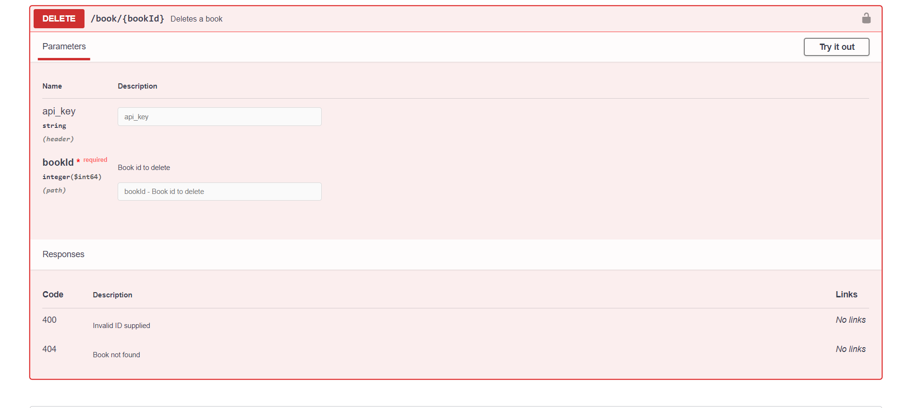

# Assignment #1: gRPC and REST API Implementation

## Member
1. นราวิชญ์ ชุติศิลป์ 		6030319921
2. นวพร ปานดี 			6030324021
3. พรณภัทร สุดใจประภารัตน์ 	6030394921
4. รวิภาส อภิกุลวณิช 		6031050121

## 1. Screenshots of Swagger for your APIs in 2.




## 2. Source codes of 2 and 3. 

## 3. Compare how to call the methods based on gRPC and REST API side-by-side, e.g. in a Table format as shown below.

| Functions  | gPRC | REST API |
| ------------- | ------------- | ------------- |
| List books  | ```function listBooks() {client.list({}, function(error, books) {printResponse(error, books);});}``` | Content Cell  |
| Insert books  | ```function insertBook(id, title, author) {var book = { id: parseInt(id), title: title, author: author }; client.insert(book, function(error, empty) {printResponse(error, empty);});}```  | Content Cell  |
| Get books | ```function getBook(id) {client.get({ id: parseInt(id) }, function(error, book) {printResponse(error, book);});}```| Content Cell  |
| Delete books  | ```function deleteBook(id) {client.delete({ id: parseInt(id) }, function(error, empty) {printResponse(error, empty);});}``` | Content Cell  |
| Stream added books  | ```function watchBooks() {var call = client.watch({}); call.on('data', function(book) {console.log(book);});}``` | Content Cell  |

## 4. What are the main differences between REST API and gRPC? 
REST API directly calls HTTP methods (GET, POST, PUT, PATCH, DELETE) while gRPC uses HTTP/2. In HTTP, the addressable entities are data entities (resources) however they are procedures due to gRPC is based on the Remote Procedure Call (RPC) model. Since gRPC makes better use of HTTP/2 then REST API, gRPC can support high performance and scalability.

## 5. What is the benefits of introduceinterface in front of the gRPC and REST API of the book services. 
- The interface helps to define APIs easily.
- Users clearly understand the interface's expected type of input and output.
- The details of the implemented function of the interface are hidden from the users.
- Easy to manage the changes and keep compatibility


## 6. Based on the introduced interface, compare how to call the methods based on gRPC and REST API side-by-side, e.g. in a Table format as shown below. 

| Functions  | gPRC | REST API |
| ------------- | ------------- | ------------- |
| List books  | ```go run client.go list```  | ```node client.js listBook```  |
| Insert books  | ```go run client.go insert <id> <title> <author>```  | ```node client.js addBook <id> <title> <author>```  |
| Get books | ```go run client.go get <id>```  | ```node client.js getBook <id>```  |
| Delete books  | ```go run client.go delete <id>```  | ```node client.js deleteBook <id>```  |
| Stream added books  | ```go run client.go watch```  | ```-```  |

## 7. Draw a component diagram representing the book services with and without interfaces. 

